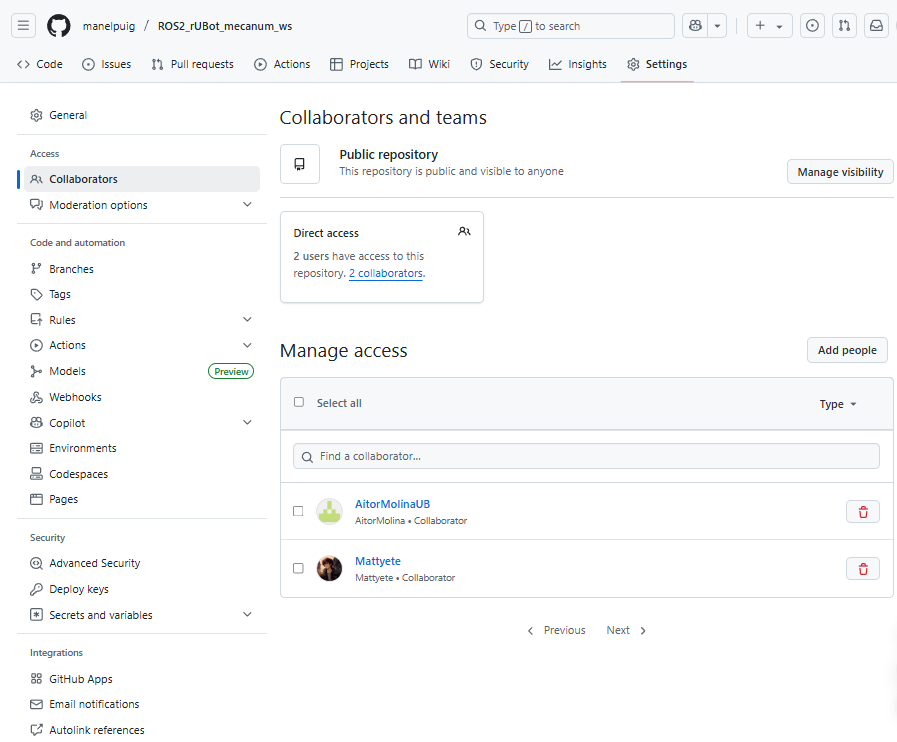
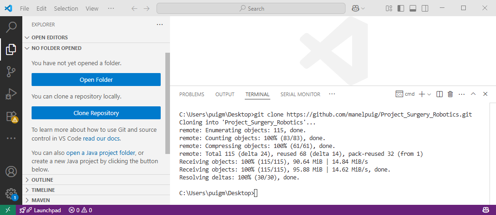
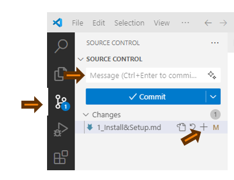

# **Social and Assistive Robotics Project setup**

The objectives of this section are:
- Setup the project in student's github
- Review the needed tools
- Update and syncronize the repository project

## **1. Setup the project in student's github**

When working in Laboratory groups, we suggest you:
- One student plays the role of `Director`. This student makes a "Fork" of the Professor's github project.
- The `Director` accept the other students as `Collaborators`

- Then the `Collaborators` will make a "fork" of the `Director`'s github project.
- The `Collaborators` will be able to update the github `Director`'s project and participate on the project generation

To work on the project (during lab sessions or for homework at home), the `Director` or `Collaborators` have to clone the `Director`'s github project in Visual Studio Code local environment.
- Open VScode on lab's PC, go to Desktop folder and clone the `Director`'s github project.

- In VScode open the folder you have cloned to work on the project

- You can work on the project and add/modify any files of the project.


## **2. Review the needed tools**

You will need to use:
- Visual Studio Code with extensions:
  - Python Extension Pack
  - Git Extension Pack
- roboDK

## **3. Update and syncronize the repository project**

When working on a Laboratory project, the objective at the end of a Lab session is to update the changes you have made. 

This can be made by any of the Lab group students, following the procedure:
  - Select "Source control" from Black left bar
  - Press Add to syncronyze all changes
  - Add a Message
  - select "Commit"
  - select "Sync"
  


The first time you will be asked to link the repository to your github account.

Open a terminal in and type the first time:
````shell
git config --global user.email "mail@alumnes.ub.edu" 
git config --global user.name "your github username"
````
>You will have to allow access to your github account.

For succesive times, you only need to select changes, Commit message and Push

The `Director` github repository has been updated!