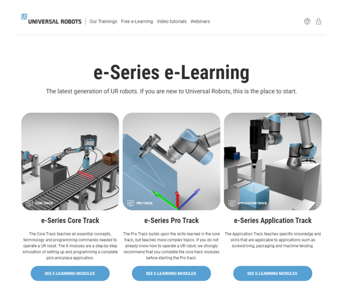

# Bachelor's Degree in Biomedical Engineering
## ROBOTICS AND CONTROL OF BIOMEDICAL SYSTEMS
### Robotic arm Universal Robot UR5e
### Laboratory session 1: Online programming

---

Universal Robots is a very reputed robotic company distributing collaborative robots for industrial, research and academic fields.

### The objective of this laboratory session will be:
* Learn about the collaborative UR robot arm
* Learn about the industrial programming of UR robotic arms

Universal Robots has a very interesting academy programme where you are able to learn very fast and easy how to use and program a robotic arm with tutorials in a very realistic virtual environment.

### During the laboratory session you will:
* Develop your own on-line Pick & Place project (one per laboratory group)
* Obtain a Robot-developer diploma following a tutorial from Universal Robots Academy during the waiting periods in the laboratory session.

---

## Robot developer diploma

This task must be performed individually, and you have to perform this task session following the instructions below:

1.  Open the link to the UR academy programme: [https://www.universal-robots.com/es/academy/](https://www.universal-robots.com/es/academy/)

    

2.  Choose the option “Empezar ahora”

    

3.  Choose the option “Únese ahora”

    

4.  Fill the blanks with the mail address xxx@alumnes.ub.edu, and continue

    

5.  Choose the option “Formacion online”

    

6.  Choose the option “Formacion online de e-series”

    

7.  Select the “e-Series Core Track” and follow the 8 lessons (84min aprox)

    

8.  Listen the whole lessons and you will obtain a diploma like this one:

    

---

## On-line programming UR5e

The online programming is performed using Polyscope program. You have already seen in the UR tutorial how to program a pick&place process on polyscope program.

In this session we will develop a pick&place process in real-time on the robot, like described in the next picture, with the following requirements:

* choose the points as you wish.
* Impose joint/linear movements.
* Impose round movements where possible.

Perform the program in Polyscope and save it in a proper format.

---

## Deliverable (D1.1)

The deliverable for this Practical exercise is:

* the PDF file of your diploma.
    * Each student has to upload his diploma. Upload this zip file when the task was created, in the virtual campus, including the name of the student.
* The “PickPlace.URP” program you have created. One program per laboratory group.