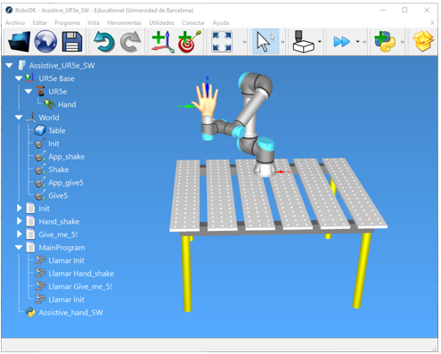
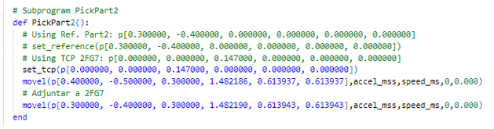
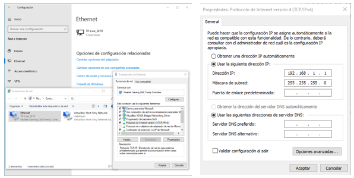
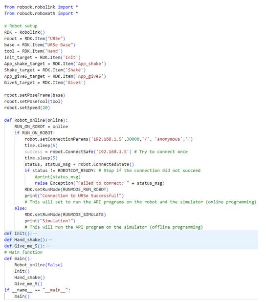

## ROBOTICS AND CONTROL OF BIOMEDICAL SYSTEMS
### Robotic arm Universal Robot UR5e
### Laboratory session 2: UR5e Social/Assistive robotic task design

---

Universal Robots is a very reputed robotic company distributing collaborative robots for industrial, research and academic fields.

### The objectives of this laboratory session will be:
* Design challenging assistive robotic tasks with the UR5e robotic arm.
* Review different methods for real-time execution of the assistive robotic tasks from a RoboDK simulation to the real UR5e robot arm.

Simulation (Off-line programming) is an interesting tool enabling the robot task simulation before its real-time execution on the UR5e robot arm.

This session has a previous task to be delivered at the beginning of the session.

## **1. Simple Social task**
The **Task** is the design of challenging assistive robotic tasks with the UR5e robotic arm and the offline simulation using Graphical scripting and Python code integrated into RoboDK.



We have made, as an example, 2 different “social” robotic tasks:
* Hand-shake task
* Give-me 5! task

We show you the simulation programs performed using graphical scripting and python code.

To create the proper python code to execute the simulation we have used the function:
`robot.MoveL(target_object_name, True)`

Verify the simulation of the 2 tasks and adapt the code to your own Social/Assistive designed task.


## **2. Real-time execution of the assistive task to the real robot**
Once you have verified that the simulation is working properly, you can proceed with the **real-time execution** of the designed and simulated assistive robotic tasks on the real UR5e robot arm.

We will review 3 different **methods**:
* **Polyscope**: uploading the automatically generated URP or script files to be executed on the robot arm.
* **RoboDK online programming**: the assistive tasks will be executed simultaneously in simulation and in the real robotic arm.
* **Python sockets**: the URScript instructions will be sent to the robot arm within the final python program.

### **2.1. Polyscope**
RoboDK, using Post-Processors, can generate programs to be executed on Polyscope directly from the Teach Pendant:
* `Program.urp`
* `Program.script`

You have to select the post-processor: **Universal Robot URP post-processor**

This gives you the program in absolute coordinates (with respect to the UR5e base). This is the recommended method.



Save the programs on a pen-drive and execute them directly on Polyscope.

### **2.2. RoboDK online programming**
RoboDK can be connected to the real robot arm with an internet cable in a local network.

To proceed you have to:
1.  Connect the computer to the UR5e robot with an ethernet cable.
2.  Fix the IP address on the PC (Network and Internet > Change adapter options > Ethernet properties > TCP/IPv4 protocol).
3.  Fix an IP for the UR5e: `manual mode > settings > network > specify IP and subnet mask`.
4.  Set the Teach Pendant to automatic mode and then select “Remote control”.
5.  Disable the firewall (Public network).



#### Execution using “Menu-bar” options
In this case you need to:
1.  Select “run on robot” (right-click on the program and all subprograms!).
2.  Connect to the UR5e robot (right-click on the robot).
3.  Select “Get position” to fix the RoboDK robot POSE to the real/actual UR5e POSE.

When you run the “MainProgram”, the real robot moves simultaneously with the simulation.


Run the pick & place program from RoboDK and the real UR5 robot will perform the movements.

#### Execution within python code
You can create a python code to fully control the simple task `Assistive_hand_SW.py` process. The options you have selected in the “Menu-bar” have their specific function in the RoboDK library:
- You only have to add a function to choose between Software (SW) or Hardware (HW) execution.

- Robot speed is fixed with `robot.setSpeed(xx)`.

- Simulation robot speed is fixed with the popup slider.

- The adapted version corresponds to the `Assistive_hand_SW_HW.py` code. 



### **2.3. Python sockets**
At the Script Level, URScript is the programming language that controls the robot. The URScript includes variables, types, and flow control statements. There are also built-in variables and functions that monitor and control I/O and robot movements.

The URScript instructions can be sent to the robot arm within a final python program using the sockets python library to establish a reliable connection to the robot. To execute a URScript-based project directly with your PC and python, you'll need to establish a socket connection to send and receive commands and data to/from the robot.

Here's a general outline of the process:

a) **Set Up Socket Communication**: In Python, you can use the `socket` module to establish a socket connection with the robot's controller. You'll need to know the IP address and port number of the robot controller to establish this connection..
```python
import socket

robot_ip = '192.168.1.5'  # Replace with the actual robot's IP address
robot_port = 30002       # Default port for UR robots

# Create a socket object
robot_socket = socket.socket(socket.AF_INET, socket.SOCK_STREAM)

# Connect to the robot controller
robot_socket.connect((robot_ip, robot_port))
```

b) Translate URScript to Python: Convert your URScript code into Python code that sends the equivalent commands over the socket connection. For example, a URScript movel command to move the robot to a specific joint configuration like this:

````Python
urscript_command = "movej([1.0, -2.0, 3.0, -4.0, 5.0, -6.0], a=1.0, v=0.1)\n"
# Send the URScript command to the robot
robot_socket.send(urscript_command.encode())
````

c) Handle Responses: After sending commands, you may need to receive and process responses from the robot controller. If we do not need response information we will wait a short period of time (the desired execution time).

````Python
response = robot_socket.recv(1024)
print(response.decode())  # Decode and print the response
````

d) Close the Socket: It's essential to close the socket when you're done.

````Python
robot_socket.close()
````
The adapted first version corresponds to the `Assistive_hand_SW_HW_sockets.py` code.

## **3. Assistive/Social robotic task dessign**

The objective is for each laboratory group to design an original Assistive/Social robotic task.

**Laboratory Task:**

Take the simple task template (Assistive_hand_SW.py) we deliver to you and make the necessary changes to adapt it to your social/assistive program. 

**Delivery**:
- Students group have to upload the Link to his github project
- The project has to contain the original Assistive/Social robotic task in a `Custom_Assistive_SW.py` file on `pyhon_scripts`folder

## **Laboratory development**

During the first hour of the laboratory session, students will see a demonstration of the 3 methods from a professor's demo project in RoboDK.

During the second hour, students will adapt and generate the proper and obtimised code for their Social-Assistive designed task. 

**Suggestions**: 
- You can improve and automate your code if you use:
    - For moveJ:
        ```python
        j1, j2, j3, j4, j5, j6 = list(np.radians(Target.Joints()))
        movej_Target = f"movej([{j1},{j2}, {j3}, {j4}, {j5}, {j6}],{accel_mss},{speed_ms},{time_high},{blend_r})"
        ```
    - For moveL:
        ```python
        X, Y, Z, Roll, Pitch, Yaw = Pose_2_TxyzRxyz(Target.Pose())
        movel_Target = f"movel(p[{X}, {Y}, {Z}, {Roll}, {Pitch}, {Yaw}], a={accel_mss}, v={speed_ms}, t={timel}, r={blend_r})"
        ````
- Try an OOP approach with a class RobotUR5e with atributes and methods.

**Objectives:**
- All the group members have to contribute to the final solution (with github project sync updates)
- demonstration tests have to be done with the real UR5e robot arm.
- This has to be done during sessions 2 and 3.
- The final presentation will be done in session 4